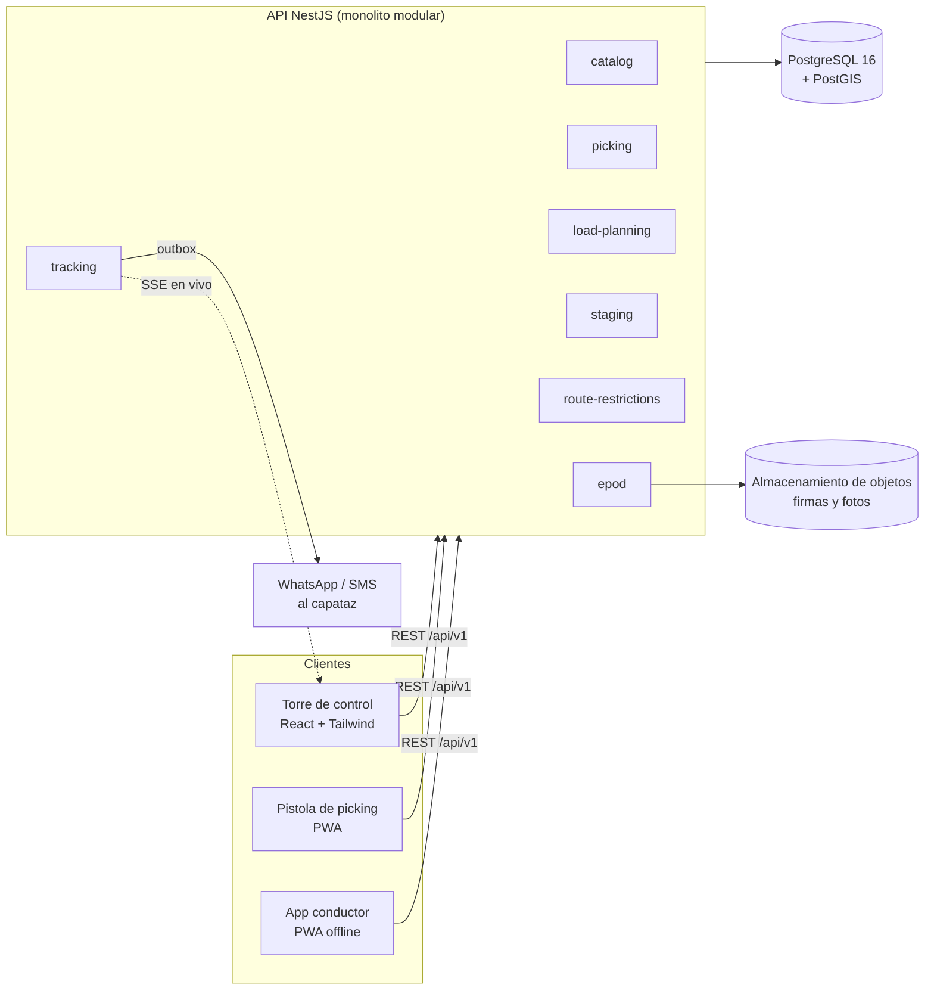
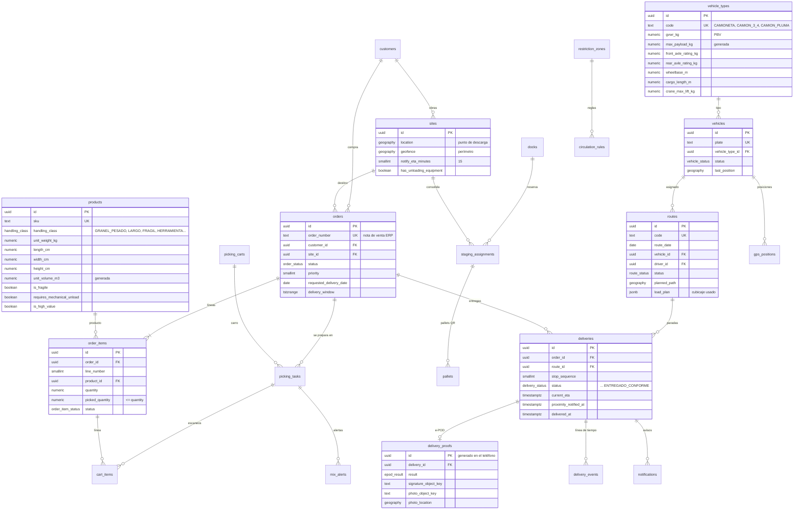

# Torre de Control Logística · Constructor Center

Plataforma web que unifica y supervisa la **logística interna** de la Bodega Los Ángeles
(WMS: picking, mezcla incompatible y staging por obra) y la **última milla** hacia las
obras del Biobío (TMS: cubicaje, restricciones de circulación, tracking GPS y e-POD).

Esta primera entrega deja la base del proyecto:

| Entregable | Estado |
|---|---|
| Estructura de directorios backend + frontend | Hecho |
| Esquema PostgreSQL + PostGIS (24 tablas, 4 vistas) con datos de demostración | Hecho y validado sobre PostgreSQL 16.14 + PostGIS 3.4.2 |
| Regla crítica: **validación de mezcla incompatible** en el carro de picking | Hecho, con tests |
| Regla crítica: **cubicaje** (peso, volumen, largo, pluma y carga por eje) | Hecho, con tests |
| API REST (NestJS 12) y pantallas de ambas reglas (React 19 + Tailwind 4) | Hecho |
| App en **un solo archivo HTML** que funciona sin servidor (celular o computador) | Hecho, generado en cada push por GitHub Actions |
| **Rastreo GPS**: modo conductor en el teléfono, mapa en vivo de la flota, trayecto y carga a bordo, aviso al capataz a 15 min | Hecho, con tests (incluye prueba con dos dispositivos) |
| **Optimizador de rutas** por consumo de diésel, con ahorro frente al despacho manual | Hecho, con tests |
| Publicación en internet (Docker + Render) con clave de acceso | Listo para activar (sección 6) |
| Persistencia en PostgreSQL, login por roles, staging, restricciones, e-POD | Próximas fases (ver hoja de ruta) |

---

## 1. Análisis del requerimiento

**Dos dominios, un mismo pedido.** El pedido nace en el ERP (nota de venta), se prepara en
bodega (picking → carros → pallets → andén) y se entrega en obra (vehículo → ruta → e-POD).
La torre de control necesita ver ese recorrido completo, así que se modela como **un monolito
modular con una sola base de datos**: un equipo, transacciones simples y vistas que cruzan
WMS y TMS sin integraciones. Cada módulo tiene fronteras claras para separarlo después si
hiciera falta.

Decisiones que se desprenden del negocio:

- **Las reglas críticas son código puro, sin framework ni base de datos.** La validación de
  mezcla y el cubicaje se prueban en milisegundos y se pueden reutilizar en la pistola de
  picking (modo sin señal) o en un proceso batch de planificación.
- **Las reglas son configuración, no constantes escondidas.** La matriz de compatibilidad,
  los umbrales de peso, las capacidades de carros y las fichas de vehículos están en un solo
  lugar y migrarán a tablas editables por el supervisor.
- **Pensado para terreno.** La pistola y el teléfono del conductor generan sus propios `uuid`,
  lo que permite reintentar envíos sin duplicar escaneos ni pruebas de entrega cuando no hay
  señal (zonas rurales de Santa Bárbara o Nacimiento).
- **PostGIS desde el día 1.** Obras con punto de descarga y geocerca, zonas de restricción
  como polígonos y posiciones GPS como `geography`: las distancias salen en metros y los
  cruces espaciales (¿qué restricciones afectan a esta obra?) son una consulta.
- **La base de datos defiende invariantes que el código podría olvidar:** no se puede reservar
  dos veces un andén en horarios que se solapan, un carro no puede estar en dos tareas
  activas, una autorización de supervisor exige quién y por qué, y una entrega "conforme"
  exige hora de entrega.

## 2. Arquitectura



Cada módulo del backend sigue la misma división en capas:

| Capa | Contenido | Depende de |
|---|---|---|
| `domain/` | Entidades, reglas y cálculos puros | nada |
| `application/` | Casos de uso y **puertos** (interfaces de repositorios) | `domain` |
| `infrastructure/` | Adaptadores: hoy en memoria, luego PostgreSQL | `application`, `domain` |
| `http/` | Controladores y esquemas Zod de entrada | `application` |

## 3. Estructura de directorios

Lo marcado como *(fase N)* está diseñado pero aún no existe en el repositorio.

```
torre-control/
├── package.json                  # scripts de conveniencia (setup, dev, test, check)
├── docker-compose.yml            # PostgreSQL 16 + PostGIS 3.4 con migración y seed
├── .env.example
├── database/
│   ├── migrations/001_init.sql   # esquema completo (WMS + TMS + geodatos + vistas)
│   └── seeds/001_demo_data.sql   # bodega, obras, catálogo, flota, zonas, pedidos de ejemplo
├── backend/                      # NestJS 12 · TypeScript · ESM · Vitest · Zod
│   ├── src/
│   │   ├── main.ts / app.module.ts / app.setup.ts
│   │   ├── common/               # DomainError, filtro HTTP 422, ZodValidationPipe
│   │   ├── health/
│   │   └── modules/
│   │       ├── catalog/          # maestro de productos con atributos logísticos
│   │       ├── picking/          # carros y VALIDACIÓN DE MEZCLA INCOMPATIBLE
│   │       │   ├── domain/       #   cart.ts · mix-policy.ts · mix-validator.ts (+ spec)
│   │       │   ├── application/  #   picking.service.ts
│   │       │   └── http/         #   picking.controller.ts · picking.schemas.ts
│   │       ├── load-planning/    # CUBICAJE y carga por eje
│   │       │   ├── domain/       #   vehicle.ts · axle-load.ts · cubicaje.ts (+ specs)
│   │       │   ├── application/  #   load-planning.service.ts · fleet-catalog.port.ts
│   │       │   ├── infrastructure/ # default-fleet.ts · in-memory-fleet-catalog.ts
│   │       │   └── http/
│   │       ├── routing/          # OPTIMIZADOR DE RUTAS por consumo de diésel
│   │       │   ├── domain/       #   delivery.ts · fuel.ts · optimizer.ts (+ specs)
│   │       │   ├── application/  #   route-planner.ts (sin framework: lo reusa el frontend)
│   │       │   └── infrastructure/ # demo-network.ts (bodega, obras, pedidos, patentes)
│   │       ├── tracking/         # RASTREO GPS de conductores
│   │       │   ├── domain/       #   tracking.ts (filtro GPS, paradas, aviso) · simulator.ts
│   │       │   ├── application/  #   tracking-hub.ts (sesiones, eventos, flota en vivo)
│   │       │   ├── http/         #   tracking.controller.ts (+ flujo SSE /tracking/stream)
│   │       │   └── infrastructure/ # demo-fleet-runner.ts (camiones simulados)
│   │       ├── staging/              (fase 2) andenes, reservas y pallets con QR
│   │       ├── route-restrictions/   (fase 3) evaluador de la matriz urbana/rural
│   │       ├── notifications/        (fase 3) outbox → WhatsApp/SMS
│   │       └── epod/                 (fase 3) firma + foto georreferenciada
│   └── test/                     # e2e con supertest (API, rastreo, SSE)
└── frontend/                     # Vite 8 · React 19 · Tailwind 4 · componentes estilo shadcn/ui
    ├── scripts/inline-html.mjs   # empaqueta la app en dist/torre-control.html
    └── src/
        ├── App.tsx               # layout de la torre de control y navegación por módulos
        ├── components/
        │   ├── ui/               # button, card, badge, input (convención shadcn/ui)
        │   ├── status.tsx        # estados con ícono + texto, medidores, KPIs
        │   ├── product-lines.tsx # editor de líneas SKU + cantidad
        │   └── map/leaflet.ts    # mapa (Leaflet + OpenStreetMap), marcadores y rutas
        ├── features/
        │   ├── picking/MixCheckPage.tsx          # validador de mezcla
        │   ├── load-planning/CubicajePage.tsx    # simulador de cubicaje
        │   ├── routing/RoutePlannerPage.tsx      # optimizar y publicar rutas
        │   ├── tracking/LiveMapPage.tsx          # mapa en vivo de la flota
        │   ├── tracking/DriverPage.tsx           # modo conductor (GPS del teléfono)
        │   ├── picking-monitor/                  (fase 2)
        │   ├── staging/                          (fase 2)
        │   └── epod/                             (fase 3) firma y foto de la entrega
        ├── lib/
        │   ├── api.ts            # elige el modo: local (sin servidor) o HTTP (backend)
        │   ├── local-api.ts      # ejecuta en el navegador las reglas de backend/src (alias @core)
        │   └── format.ts, utils.ts
        └── types/api.ts          # contratos de la API
```

## 4. Esquema de base de datos

Archivo: [`database/migrations/001_init.sql`](database/migrations/001_init.sql).

Convenciones: tablas y columnas en inglés; **valores de negocio en español** (`ENTREGADO_CONFORME`,
`GRANEL_PESADO`, ...) tal como los usa la operación; PK `uuid`; coordenadas
`geography(..., 4326)`; instantes en `timestamptz`.



### Tablas por área

| Área | Tablas | Notas |
|---|---|---|
| Maestros | `app_users`, `customers`, `warehouses`, `sites`, `products` | `sites.geofence` debe contener `sites.location` (CHECK con `ST_Covers`) |
| Pedidos y picking | `orders`, `order_items`, `picking_carts`, `picking_tasks`, `cart_items`, `mix_alerts` | Índice único parcial: un carro, una tarea activa. `mix_alerts` audita bloqueos y autorizaciones |
| Staging por obra | `docks`, `staging_assignments`, `pallets` | `EXCLUDE USING gist` impide reservas solapadas del mismo andén |
| Flota y rutas | `vehicle_types`, `vehicles`, `routes` | Ficha técnica completa para el cubicaje; `routes.load_plan` guarda la decisión |
| Última milla | `deliveries`, `delivery_proofs`, `delivery_events`, `gps_positions`, `notifications` | `notifications.dedupe_key` evita avisar dos veces al capataz cuando el GPS oscila en el umbral |
| Restricciones | `restriction_zones`, `circulation_rules` | Polígonos + ventanas horarias (hora local, admite cruce de medianoche), límites de peso y largo |
| Rastreo (migración 002) | `driver_sessions`, `gps_positions.session_id`, consumo en `vehicle_types`, combustible planificado en `routes` | Índice único parcial: un vehículo, una sesión activa |

### Vistas para la torre de control

- `v_picking_progress`: avance por líneas **y por peso**. En un pedido con 60 sacos y un
  taladro, pickear el taladro no es "50 %".
- `v_order_load_profile`: peso, volumen, largo máximo y clases por pedido (entrada del cubicaje).
- `v_site_restriction_zones`: zonas que afectan a cada obra, por cruce espacial.
- `v_epod_audit`: distancia entre la foto del e-POD y la obra, y si cayó dentro de la geocerca.
- `v_live_fleet` y `v_session_tracks` (002): última posición por sesión activa y trayecto
  recorrido como línea con su distancia.

## 5. Reglas de negocio implementadas

### 5.1 Validación de mezcla incompatible (picking)

`backend/src/modules/picking/domain/mix-validator.ts`. Cuando el picker escanea un ítem,
se evalúa contra lo que ya está en el carro:

| Regla | Severidad | Ejemplo |
|---|---|---|
| Matriz de clases: `GRANEL_PESADO` × `FRAGIL` / `HERRAMIENTA`, `LARGO` × `FRAGIL` | **Bloqueo** | Cemento en el carro con un taladro Makita |
| Matriz de clases: `LARGO` × `HERRAMIENTA`, `QUIMICO` × `GRANEL_PESADO` / `HERRAMIENTA` | Advertencia | Diluyente junto a un esmeril Bosch |
| Ítem ≥ 20 kg por unidad junto a un frágil o una herramienta, **sea cual sea su clase** | **Bloqueo** | Caja de clavos de 25 kg (clase `GENERAL`) sobre cerámica: defensa ante errores en el maestro |
| Lado más largo de la unidad > largo admitido por el carro | **Bloqueo** | Fierro de 6 m en carro modular |
| Peso o volumen del carro > capacidad | **Bloqueo** | |
| Carro ≥ 90 % de capacidad | Advertencia | "Prepare el siguiente carro" |

Decisión: `PERMITIDO`, `PERMITIDO_CON_ADVERTENCIA` o `BLOQUEADO`. Sólo se reportan conflictos
en los que participa el ítem entrante (lo que ya estaba en el carro ya fue resuelto o
autorizado). `auditCart` revisa el carro completo.

```http
POST /api/v1/picking/mix-check
{ "cartType": "MODULAR",
  "currentLines": [{ "sku": "MAK-HP1630", "quantity": 1 }],
  "incoming": { "sku": "CEM-ESP-25", "quantity": 2 } }

200 → { "decision": "BLOQUEADO",
        "violations": [{ "rule": "MEZCLA_INCOMPATIBLE", "severity": "BLOQUEO",
                         "skus": ["CEM-ESP-25", "MAK-HP1630"], "message": "Mezcla incompatible: ..." }],
        "load": { "totalWeightKg": 52.3, "weightUtilization": 0.209, ... },
        "cart": { "type": "MODULAR", "maxLoadKg": 250, ... } }
```

### 5.2 Cubicaje y asignación de vehículo (última milla)

`backend/src/modules/load-planning/domain/cubicaje.ts`. Para cada tipo de vehículo de la flota:

1. **Peso** total ≤ carga útil (PBV − tara).
2. **Volumen** ≤ volumen de la plataforma × factor de estiba (0,85 con carga mixta).
3. **Largo**: la unidad más larga ≤ plataforma + voladizo permitido (fierros de 6 m → camión pluma).
4. **Descarga mecánica**: unidades > 25 kg (Ley 20.949) o marcadas en el maestro exigen
   **camión pluma**, salvo que la obra declare grúa horquilla; la pluma debe levantar la unidad más pesada.
5. **Carga por eje** con la regla de la palanca: el eje trasero recibe P·x/L y el delantero
   P·(L−x)/L. Cada eje se compara con el menor entre su capacidad de fabricante y el límite
   legal chileno (DS 158 MOP: 7 t eje simple rueda simple, 11 t rueda doble), y se exige al
   menos un 20 % del peso sobre la dirección. La posición de la carga (cabina, centro o cola)
   es un parámetro del simulador.

Recomienda el vehículo factible de **menor costo por km**. Si nada cabe en un viaje, sugiere
dividir la carga (cota mínima de viajes, considerando sólo vehículos cuyos problemas se
resuelven repartiendo).

```http
POST /api/v1/load-planning/cubicaje
{ "lines": [{ "sku": "FIE-A630-12", "quantity": 40 }],
  "siteHasUnloadingEquipment": false, "loadCenterRatio": 0.5 }

200 → { "profile": { "totalWeightKg": 213.2, "longestItemM": 6, ... },
        "recommendation": { "vehicleCode": "CAMION_PLUMA", "feasible": true, ... },
        "evaluations": [ /* CAMIONETA y CAMION_3_4 con issue EXCEDE_LARGO */ ],
        "splitSuggestion": null }
```

Las **restricciones de circulación** (horarios, puentes) no se mezclan aquí: el módulo
`route-restrictions` (fase 3) filtrará la flota permitida para la obra y la hora antes de
llamar al cubicaje.

### 5.3 Rastreo GPS y mapa en vivo

- **Modo conductor** (`#conductor`, pensado para el teléfono): el conductor ingresa su nombre,
  elige el vehículo y toca *Activar GPS e iniciar ruta*. El teléfono envía su posición cada
  5 s; si pierde señal acumula las lecturas y las manda al recuperarla. Ve su próxima obra con
  la hora estimada de llegada, sus paradas y lo que lleva para cada una.
- **Filtro del GPS** (`tracking/domain/tracking.ts`): descarta lecturas con más de 100 m de
  error, fuera de orden o con saltos imposibles (más de 150 km/h).
- **Paradas y avisos**: con la ETA (línea recta × 1,3 a la velocidad actual o 40 km/h) se
  registra *AVISO_PROXIMIDAD* cuando falta lo configurado para la obra (15 min, una sola vez),
  *LLEGADA_OBRA* al entrar a 150 m y *SALIDA_OBRA* al salir (descarga terminada).
- **Mapa en vivo** (`#mapa`): todos los vehículos en ruta con su estado (en movimiento,
  detenido, sin señal), trayecto recorrido, paradas pendientes, carga a bordo y feed de
  eventos. Se actualiza por Server-Sent Events, sin recargar.
- En modo demostración (`TRACKING_DEMO`, activo por defecto) camiones simulados recorren el
  plan publicado; un conductor real reemplaza al simulado de su vehículo.

Límite importante: el navegador del teléfono **sólo envía la ubicación con la app abierta en
pantalla** (se pide mantener la pantalla encendida). El rastreo con el teléfono bloqueado o en
segundo plano requiere una app nativa (por ejemplo, empaquetar esta misma interfaz con
Capacitor), prevista en la hoja de ruta.

### 5.4 Optimizador de rutas por combustible

`routing/domain/optimizer.ts`. Asigna los pedidos del día a los camiones y ordena las paradas
para minimizar el diésel, con la técnica habitual de los sistemas de ruteo (TMS):

1. Cada pedido pasa por el cubicaje para saber qué vehículos lo pueden llevar (fierros de
   6 m sólo en pluma, maxisacos con pluma salvo grúa en obra, capacidad, ejes).
2. **Construcción**: primero los pedidos más restringidos; cada uno donde menos litros agrega.
3. **Búsqueda local** hasta que nada mejora: 2-opt (invertir tramos) y reubicar entregas entre
   camiones. El consumo se interpola entre vacío y plena carga según lo que va a bordo en cada
   tramo, así que conviene descargar lo pesado temprano.
4. Se compara con el **despacho manual** (orden de nota de venta, primer camión que sirva) y se
   informa el ahorro en litros, pesos y CO₂. Con los pedidos de ejemplo ahorra 10,5 L (13 %).

Al **publicar** el plan, cada conductor ve su ruta y su carga al iniciar en modo conductor.
Distancias estimadas en línea recta × 1,3: el siguiente paso es usar distancias reales por
calle (motor OSRM) y ventanas horarias de las obras.

### Otros endpoints

| Método | Ruta | Uso |
|---|---|---|
| GET | `/api/v1/health` | Salud |
| GET | `/api/v1/catalog/products` | Catálogo con atributos logísticos |
| GET | `/api/v1/picking/cart-types` | Capacidades por tipo de carro |
| POST | `/api/v1/picking/cart-audit` | Revisión completa de un carro |
| GET | `/api/v1/load-planning/vehicle-types` | Flota con carga útil, volumen y largo derivados |
| GET | `/api/v1/routing/deliveries` | Pedidos a despachar con su carga y vehículos posibles |
| POST | `/api/v1/routing/optimize` | Optimiza rutas (`deliveryIds`, `dieselPriceClp`) |
| POST | `/api/v1/routing/plans/:id/publish` | Publica el plan a la flota |
| GET | `/api/v1/routing/plans/active` | Plan publicado |
| GET | `/api/v1/tracking/units` | Vehículos para el conductor, con sus paradas asignadas |
| POST | `/api/v1/tracking/sessions` | Inicia la ruta de un conductor |
| POST | `/api/v1/tracking/sessions/:id/positions` | Lote de lecturas GPS (hasta 500) |
| POST | `/api/v1/tracking/sessions/:id/end` | Termina la ruta |
| GET | `/api/v1/tracking/sessions/:id/track` | Trayecto recorrido y resumen |
| GET | `/api/v1/tracking/live` · `/api/v1/tracking/stream` | Flota en vivo (foto · flujo SSE) |

Errores: `400 SOLICITUD_INVALIDA` con detalle por campo (Zod) y `422` para reglas de negocio
(`SKU_DESCONOCIDO`, `CANTIDAD_INVALIDA`, `CARGA_VACIA`).

## 6. Usar la app

La interfaz tiene dos modos y las reglas son **el mismo código** en ambos (el frontend
importa el dominio desde `backend/src`):

| Modo | Cuándo | Qué necesita |
|---|---|---|
| **Local** (por defecto) | Probar y usar las reglas desde cualquier dispositivo | Nada: todo se calcula en el navegador |
| **API** | Rastreo real entre dispositivos (teléfonos de conductores → torre de control) | El backend NestJS publicado con HTTPS |

### Publicar en internet (necesario para el GPS de los conductores)

El GPS del navegador exige `https://`, y para que la torre vea los teléfonos todos deben
hablar con el mismo servidor. El repositorio trae la imagen (`torre-control/Dockerfile`: API
+ interfaz en un solo servicio) y el blueprint de Render (`render.yaml` en la raíz):

1. Crear una cuenta en [render.com](https://render.com) y conectar GitHub.
2. *New → Blueprint* → elegir este repositorio → *Apply*.
3. Abrir la URL que entrega Render (`https://torre-control-xxxx.onrender.com`). Usuario
   `torre`; la clave está en el servicio → *Environment* → `BASIC_AUTH_PASSWORD`.
4. En los teléfonos de los conductores abrir `…/#conductor`; en la oficina, `…/#mapa`.

Notas: el plan gratuito de Render duerme tras un rato sin uso (la primera visita tarda) y el
estado vive en memoria hasta conectar PostgreSQL (fase 2), así que se reinicia con cada
despliegue. Para operar sin camiones simulados: `TRACKING_DEMO=false`. Cualquier servicio que
ejecute Docker sirve igual (Railway, Fly.io, un VPS).

### Abrir desde el celular o el computador

- **Archivo HTML:** cada push a GitHub ejecuta el workflow *Torre de Control* y deja
  `torre-control.html` en *Actions → (última ejecución) → Artifacts*. Se descarga y se abre
  con doble clic o desde el gestor de archivos del teléfono; no necesita internet.
  También se genera localmente con `npm run build:html` (queda en `frontend/dist/`).
- **GitHub Pages (opcional):** este repositorio es privado y Pages en repositorios privados
  requiere plan GitHub Pro o superior; además el sitio publicado queda **público**. Si se
  decide publicarlo: *Settings → Pages → Source: GitHub Actions* y luego
  *Settings → Secrets and variables → Actions → Variables* con `DEPLOY_PAGES = true`.
  Desde ese momento cada push a la rama por defecto publica la app.

### Desarrollo

Requisitos: Node.js 22 o superior y Docker (sólo para la base de datos).

```bash
cd torre-control
npm run setup          # instala backend y frontend (npm ci)
npm run dev:web        # interfaz en http://localhost:5173, modo local
npm run dev:api        # API en http://localhost:3000/api/v1
npm run dev:web:api    # interfaz en modo API (proxy /api → :3000)

npm run check          # typecheck + lint + tests unitarios + e2e + build del frontend
npm run build:html     # app en un solo archivo: frontend/dist/torre-control.html
npm run db:up          # PostgreSQL + PostGIS con esquema y datos de demostración
```

La API todavía usa catálogo y flota **en memoria** (los mismos datos del seed), así que no
necesita la base de datos para probar las dos reglas.

## 7. Supuestos y valores a validar con la operación

Todos están en un solo lugar y son fáciles de cambiar:

- **Flota** (`load-planning/infrastructure/default-fleet.ts` y seed): especificaciones
  representativas de camioneta, camión 3/4 y camión pluma. Reemplazar por las fichas técnicas
  reales (PBV, tara por eje, distancia entre ejes, plataforma, capacidad de la pluma).
- **Límites legales por eje**: DS 158/1980 MOP como referencia. Puentes y caminos rurales
  pueden ser más restrictivos y van en `circulation_rules`.
- **Restricciones de circulación del seed**: son **ilustrativas**. Hay que validarlas con la
  Dirección de Tránsito de Los Ángeles y con Vialidad antes de operar.
- **Matriz de mezcla, umbral de 20 kg y aviso al 90 %** (`picking/domain/mix-policy.ts`):
  revisar con el jefe de bodega.
- **Capacidades de carros** (`picking/domain/cart.ts`): medir los carros reales.
- **Coordenadas** de bodega, obras y zonas: aproximadas.
- **Consumo de diésel por vehículo** (vacío / plena carga, L/100 km) y **precio del diésel**
  (1.050 CLP/L por defecto, editable en pantalla): reemplazar por los rendimientos reales de
  cada camión.
- **Velocidad media 45 km/h y factor de recorrido 1,3**: calibrar con los trayectos que ya
  registra el GPS (`v_session_tracks`).

## 8. Hoja de ruta

| Fase | Alcance |
|---|---|
| **2 · Operación de bodega** | Adaptadores PostgreSQL (Kysely) para los puertos actuales; autenticación y roles; flujo de tareas de picking con escaneo persistido y autorización de supervisor (`mix_alerts`); monitor de picking; staging virtual por obra con reservas de andén y etiquetas QR |
| **3 · Última milla** | Guardar sesiones y GPS en PostgreSQL (`driver_sessions`, `gps_positions`); envío real del aviso al capataz (outbox → WhatsApp/SMS); evaluador de la matriz de restricción que filtra la flota antes de optimizar; e-POD con firma, foto georreferenciada y subida firmada a S3/MinIO; app nativa del conductor (Capacitor) para rastreo en segundo plano |
| **4 · Escala** | Distancias reales por calle (OSRM) y ventanas horarias en el optimizador; varios viajes por camión; particionado de `gps_positions` (o TimescaleDB); contratos compartidos (OpenAPI); integración con el ERP |
